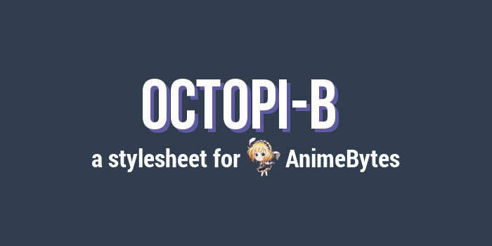

# Octopi-B

Preview of <i>Octopi-B</i> available <a href="https://animebytes.tv/forums.php?action=viewthread&threadid=23473">here</a>.

About
-------------------------------

<i>Octopi-B</i> is a custom stylesheet for </i>AnimeBytes</i> (compatible with Coalbytes and Tentacletastic).

Userstyles are CSS code designed to alter the appearance of one, some, or all sites.

Instruction
-------------------------------

<strong>Step 1 : Install Stylish or Stylus</strong>

Depending of your browser.
<ol>
<li>for Mozilla Firefox : <a href="https://addons.mozilla.org/en-US/firefox/addon/stylish/">Stylish</a> or <a href="https://addons.mozilla.org/en-US/firefox/addon/styl-us/">Stylus</a></li>
<li>for Google Chrome : <a href="https://chrome.google.com/webstore/detail/stylish-custom-themes-for/fjnbnpbmkenffdnngjfgmeleoegfcffe?hl=en">Stylish</a> or <a href="https://chrome.google.com/webstore/detail/stylus/clngdbkpkpeebahjckkjfobafhncgmne?hl=en">Stylus</a></li>
<li>for Opera : <a href="https://addons.opera.com/en/extensions/details/stylish/">Stylish</a> or <a href="https://addons.opera.com/en-gb/extensions/details/stylus/?display=en">Stylus</a></li>
<li>for Safari : <a href="http://sobolev.us/stylish/">Stylish</a></li>
<li> for Dolphin : <a href="https://play.google.com/store/apps/details?id=ru.pmmlabs.stylish&amp;hl=en">Stylish</a></li>
</ol>

<strong>Step 2 : Install the script </strong>
<ol>
<li> Via userstyles (<a href="https://userstyles.org/styles/158323/octopi-b-light-animebytes-css">light version</a> or <a href="https://userstyles.org/styles/158322/octopi-b-dark-animebytes-css">dark version</a>) : click the button <i>install Style</i> and it's done.</li>
<li> Or manually (<a href="https://pastebin.com/31PFdq6w">light version</a> or <a href="https://pastebin.com/7XaPFTVG">dark version</a>) : create a new style in Stylish/Stylus and copy/paste the script in it. The script was written for Firefox Mozilla, that's why for Google Chrome and such, you'll have to click the button <i>Import from Mozilla.</i></li>
<li><b>(NEW) STYLUS ONLY</b> : 
</ol>

<strong>Step 3 : Install others script </strong>
<ol>
<li><a href="https://greasyfork.org/en/scripts/36989-animebytes-misc-edition">AnimeBytes : Misc Edition</a>
</ol>

<strong>Step 4 : Install the font </strong>

I use several fonts for my custom stylesheet.
<ol>
<li> <a href="http://www.freejapanesefont.com/bokutachi-gothic-2-bold/">Bokutachi no Gothic 2 </a></li>
<li> <a href="https://www.freejapanesefont.com/kf-himaji/">KFhimaji</a></li>
<li> <a href="https://www.fontsquirrel.com/fonts/roboto">Roboto</a></li>
</ol>

<strong>Step 5 : Show your appreciation </strong>
<ol>
<li>Feel free to comment this submission (critique, suggestion, compliment, etc).</li>
<li>If you like my works, don't hesitate to watch me.</li>
<li>You can share it, but don't forget to mention me.</li>
</ol>

Report
-------------------------------

Don't hesitate to report any issues you find while using this userstyle.
